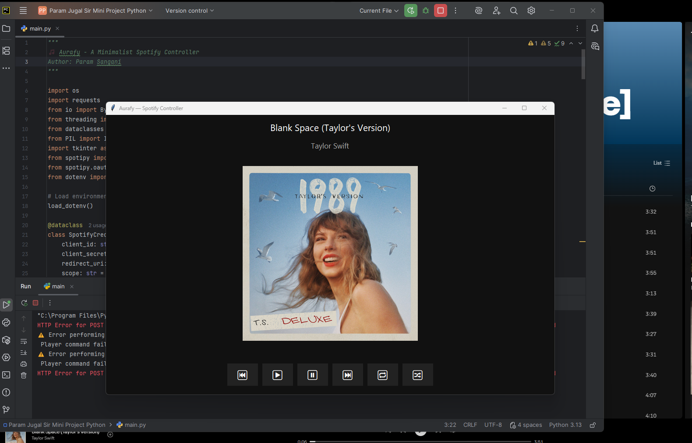

# 🎵 Aurafy — A Minimalist Spotify Controller

*A simple, elegant desktop Spotify controller built with Python and Tkinter.*

---

## ✨ Features

- 🎧 **Playback Controls:** Play, pause, skip, previous track  
- 🔁 **Repeat & Shuffle:** Toggle repeat and shuffle modes  
- 🔍 **Search Music:** Search tracks directly from the app  
- 🖼️ **Now Playing View:** Displays current song info and album art  
- 💚 **Spotify Integration:** Uses [Spotipy](https://spotipy.readthedocs.io/) and Spotify Web API  

---

## 🧩 Tech Stack

| Component | Description |
|------------|-------------|
| **Python 3.8+** | Core programming language |
| **Tkinter** | GUI framework |
| **Spotipy** | Spotify Web API client |
| **Pillow (PIL)** | Image handling for album art |
| **Dotenv** | Environment variable management |

---

## ⚙️ Setup & Installation

### 1. Clone the Repository
### 2. Install Dependencies
### 3. Set Up Spotify API Credentials

1. Go to Spotify Developer Dashboard

2. Create a new app

3. Copy your Client ID and Client Secret

4. Add a Redirect URI (e.g. https://example.org)

5. Create a .env file in the project root

## 🐞 Troubleshooting

- App not opening? Ensure Tkinter is installed and your Python version is ≥ 3.8.

- No track showing? Make sure Spotify is open and playing on a connected device.

- Auth errors? Check your .env values and Spotify redirect URI.

## 🧑‍💻 Author

- Param Sangani

- 💬 "Built for simplicity. Designed for focus."

- 🔊 Volume control

- ❤️ Liked songs management

- 📱 Cross-platform packaging with PyInstaller

- 🌈 Contributions Welcome!

Pull requests, bug reports, and feature suggestions are encouraged.
If you like Aurafy, give it a ⭐ on GitHub!
